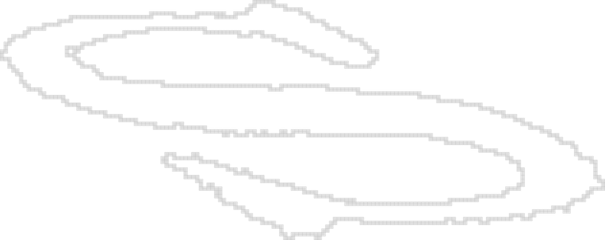
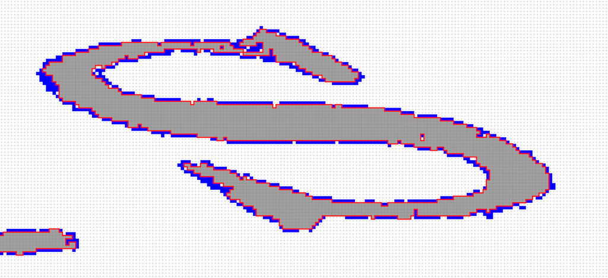

# ACCV2016DGPTutorial
ACCV 2016 Tutorial on  Digital Geometry Processing : Extracting High Quality Geometric Features


## Preliminary
Before starting the tutorial you need to have the following dependancies:


## Simple Installation of the DGtal Library 
To follow the tutorial exercice based on the DGtal Library, you can follow the given step:

 - Clone the current version of DGtal: (or get the archive from a given USB key):
    ```
      git clone git@github.com:DGtal-team/DGtal.git
    ```
 
 - Do to the given downloaded directory of the Library and recopy the given command lines: 
   - ```cd DGtal;``` 
   - ```mkdir build; cd build```
   - cmake .. -DBUILD_EXAMPLES=FALSE -DBUILD_TESTING=FALSE
   - make -j 5 
 
 - Alternatively you can use ccmake and selects in the interface the associated options.
 
 
## Getting the source base file of exercises based on DGtal:

To start using the Libray and check the installation, we will first
need to clone this main repository (and/or fork it):
  ```
  git clone  git@github.com:kerautret/ACCV2016DGPTutorial.git
  ```
Then you can configure 

input contour given from a simple list of points:


## List of exercices:

### exercise 1:  see [instructions](exercise1baseDGtal/README.md)
The objective of this first exercise is to read input contour point and display it with Board2D.

You will generate result similar to:
<center>
<a href="exercise1baseDGtal/results/res.png"></a>
</center>


### exercice 2:  see [instructions](exercise2LSC/README.md)

The aim of this exercise is to extract the 2D level sets contours from
a gray scale image and an given selected interval.

You will generate results similar to:
<center>
<a href="exercise2LSC/results/res.png"></a>
</center>


### exercise 3: see [instructions](exercise3curvatures/README.md)


