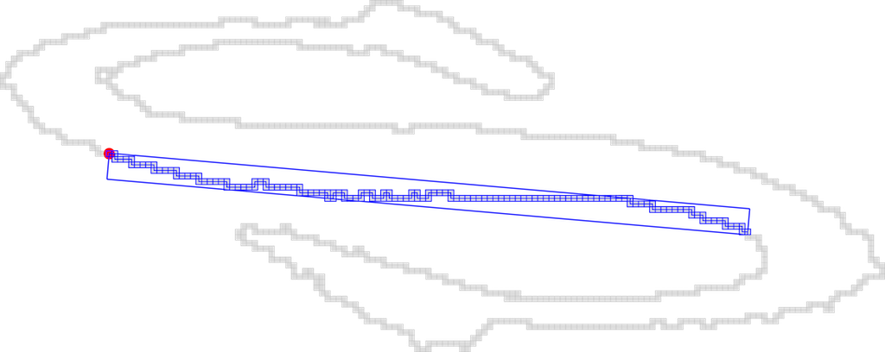

# ACCV2016DGPTutorial
ACCV 2016 Tutorial on  Digital Geometry Processing : Extracting High Quality Geometric Features


Linux/MacOs build: [](https://travis-ci.org/kerautret/ACCV2016DGPTutorial)

Windows build: [](https://ci.appveyor.com/project/kerautret/accv2016dgptutorial/branch/master)


## Requires
Before starting the tutorial you need to have the following dependancies:

  - CMake >= 2.6
  - Boost >= 1.46 (modules: program_options)
  - [DGtal](https://github.com/DGtal-team/DGtal)


## Simple Installation of the DGtal Library 

To install DGtal follows theses steps: (more details available on the [official site](http://www.dgtal.org))

 - Clone the current version of DGtal: (or get the archive from a given USB key):
    ```
      git clone git@github.com:DGtal-team/DGtal.git
    ```
 
 - Then recopy the following command lines: 
   - `cd DGtal;` 
   - `mkdir build; cd build`
   - `cmake .. -DBUILD_EXAMPLES=FALSE -DBUILD_TESTING=FALSE`
   - `make -j 5`
 
 - Alternatively you can use `ccmake` and select in the interface the associated options.
 
 


## List of exercices:

### Tuto 1: basic DGTal (see [instructions](tuto1_baseDGtal/README.md))
The objective of this first exercise is to read an input contour and display it with `Board2D`.

You should obtain something like that:
<center>
<a href="tuto1_baseDGtal/results/res.png"></a>
</center>


### Tuto 2: level set contours (see [instructions](tuto2_LSC/README.md))

The aim of this exercise is to extract the 2D level sets contours from
a gray scale image and an given selected interval.

You should obtain something like that:
<center>
<a href="tuto2_LSC/results/res.png"></a>
</center>


### Tuto 3: extracting curvature from DCA (see [instructions](tuto3_curvatures/README.md))
In this tutorial exercice, we show a simple curvature extraction
defined from the recognition of Digital Circular Arcs.


You should obtain something like that:
<center>
<a href="tuto3_curvatures/results/res.png"></a>
</center>


### Tuto 4: computing Alpha Thick Segment (see [instructions](tuto4_compATS/README.md))
In this exercise we simply apply the recognition of a maximal Alpha Thick Segment.


You should obtain something like that:
<center>
<a href="tuto4_compATS/results/res.png"></a>
</center>


### Tuto 5: Tangential Cover (see [instructions](tuto5_compATSTC/README.md))
Here  we explore the helper functions of the `SegmentComputerUtils` class `DGtal/geometry/curves/SegmentComputerUtils.h` in order to compute all the maximal AlphaThickSegment covering a given point.


You should obtain something like that:
<center>
<a href="tuto5_compATSTC/results/res.png"></a>
</center>


### Tuto 6: Meaningful Thickness  (see [instructions](Computing the Meaningful Thickness))

The main objective is to compute the Meaningful Thickness for a given point (a) and then for all the contour points (b).

You will generate results similar to:
<center>
<table>
<tr>
<td ><a href="tuto6_compMT/results/res.png"></a></td>
<td ><a href="tuto6_compMT/results/res.png"></a></td>
</tr>
<tr>
<td align="center" >(a)</td>
<td align="center" >(b)</td>
</tr>

</center>


