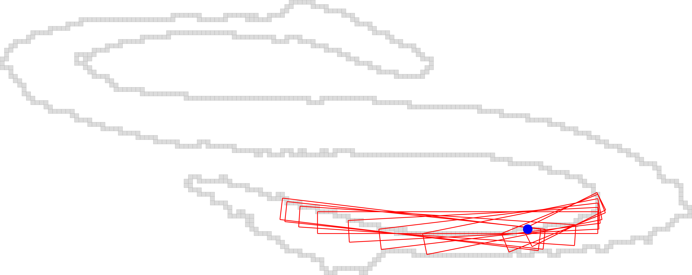

# ACCV2016DGPTutorial
ACCV 2016 Tutorial on  Digital Geometry Processing : Extracting High Quality Geometric Features


Linux/MacOs build: [](https://travis-ci.org/kerautret/ACCV2016DGPTutorial)

Windows build: [](https://ci.appveyor.com/project/kerautret/cdcvam)


## Requires
Before starting the tutorial you need to have the following dependancies:

  - CMake >= 2.6
  - Boost >= 1.46 (modules: program_options)
  - [DGtal](https://github.com/DGtal-team/DGtal)


## Simple Installation of the DGtal Library 
To follow the tutorial exercice based on the DGtal Library, you can follow the given step:

 - Clone the current version of DGtal: (or get the archive from a given USB key):
    ```
      git clone git@github.com:DGtal-team/DGtal.git
    ```
 
 - Do to the given downloaded directory of the Library and recopy the given command lines: 
   - ```cd DGtal;``` 
   - ```mkdir build; cd build```
   - cmake .. -DBUILD_EXAMPLES=FALSE -DBUILD_TESTING=FALSE
   - make -j 5 
 
 - Alternatively you can use ccmake and selects in the interface the associated options.
 
 
## Getting the source base file of exercises based on DGtal:

To start using the Libray and check the installation, we will first
need to clone this main repository (and/or fork it):
  ```
  git clone  git@github.com:kerautret/ACCV2016DGPTutorial.git
  ```
Then you can configure 

input contour given from a simple list of points:


## List of exercices:

### Tuto 1:  see [instructions](tuto1_baseDGtal/README.md)
The objective of this first exercise is to read input contour point and display it with Board2D.

You will generate result similar to:
<center>
<a href="tuto1_baseDGtal/results/res.png"></a>
</center>


### Tuto 2:  see [instructions](tuto2_LSC/README.md)

The aim of this exercise is to extract the 2D level sets contours from
a gray scale image and an given selected interval.

You will generate results similar to:
<center>
<a href="tuto2_LSC/results/res.png"></a>
</center>


### Tuto 3: see [instructions](tuto3_curvatures/README.md)
In this tutorial exercice, we show a simple curvature extraction
defined from the recognition of Digital Circular Arcs.


You will generate results similar to:
<center>
<a href="tuto3_curvatures/results/res.png"></a>
</center>


### Tuto 4: see [instructions](tuto4_compATS/README.md)
In this exercise we simply apply the recognition of a maximal Alpha Thick Segment.


You will generate results similar to:
<center>
<a href="tuto4_compATS/results/res.png"></a>
</center>

### Tuto 5: see [instructions](tuto5_compATSTC/README.md)
Here  we explore the helper functions of the ```SegmentComputerUtils``` class ```DGtal/geometry/curves/SegmentComputerUtils.h``` in order to compute all the maximal AlphaThickSegment.


You will generate results similar to:
<center>
<a href="tuto4_compATS/results/res.png"></a>
</center>


