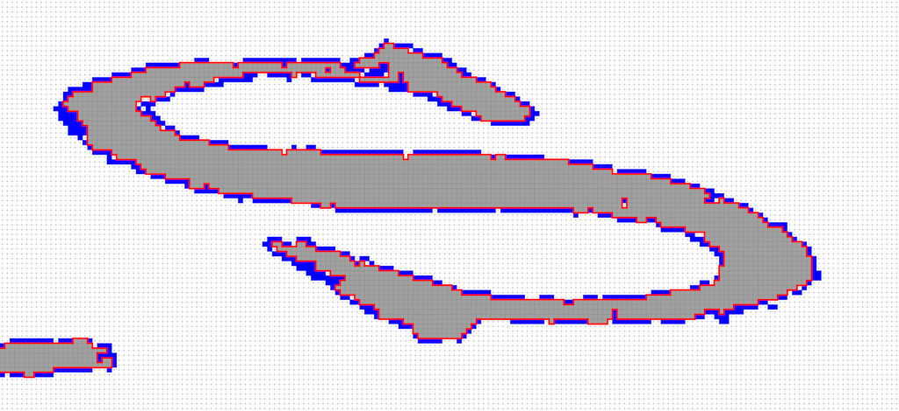

## Tutorial Exercise 2: Extracting Level Sets Contours

The aim of this exercise is to extract the 2D level sets contours from a gray scale image and an given selected interval.

  - [ ] **question 1**: Reading input file: 
     => choose an image type: ```#include <DGtal/images/ImageContainerBySTLVector.h>```
     => use the PGMReader from io/readers 
       ```Image image = DGtal::PGMReader<Image>::importPGM(filename);`` 
  
  - [ ] **question 2**: Init a Khalimksy Space (to extract boundary object from topology definitions)
     => use  Z2i::KSpace to obtain directly the 
     => use lower bounds from the domain of the image.
     
  - [ ] **question 3**: defines a Digital set2d
     => use Z2i::DigitalSet constructed from the image domain
     => use static method SetFromImage to append the cells defined from an interval of values (```DGtal/images/imagesSetsUtils/SetFromImage.h```)
     
  - [ ] **question 4**: displays the cells with a Board2D and displays the image domain.
     =>  by using the operator ```<<``` on the Board2D.
     => extensions: use  CustomStyle and  CustomColors to display other of intervals of pixels
   
   
  - [ ] **question 5**: By constructing a surfel adjacency (```SurfelAdjacency<2> sAdj( true )```) and by using the method to extract all the Contour 4 connexe defined in Surfaces<Z2i::KSpace>.
   
  - [ ] **question 6**: for each contour, constructs its associated FreemanChain and displays them.


You should obtain such a visualization:

  <center>
  <a href="results/res.png"></a>
  </center>


