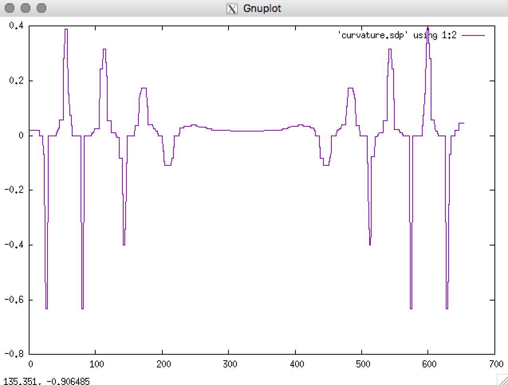

## Tutorial Exercise 3: Applying recent cuvature estimator

In this tutorial exercice, we show a simple curvature extraction
defined from the recognition of Digital Circular Arcs.
[Tristan Roussillon, Jacques-Olivier Lachaud:
Accurate Curvature Estimation along Digital Contours with Maximal Digital Circular Arcs. IWCIA 2011: 43-55]


  - [ ] **question 1** : from reading the sample fils ```accFlow.sdp```, construct a ```GridCurve``` which will be initialized from the set of points.
     => you will need to add this include ```"DGtal/geometry/curves/GridCurve.h```

  - [ ] **question 2** : define the type need to iterate on the input contour:
     ```
     typedef GridCurve<>::IncidentPointsRange Range;
     typedef Range::ConstIterator ClassicIterator;
     ```
     and construct a vector to save the estimated curvature values and construct a range associated to the input curve .
     
  - [ ] **question 3** : to compute the curvature from DCA you need to include the class to compute the circular arc (StabbingCircleComputer)   and to compute the curvature and add the given types:
    ```
     #include "DGtal/geometry/curves/estimation/MostCenteredMaximalSegmentEstimator.h"
     #include "DGtal/geometry/curves/StabbingCircleComputer.h"

     typedef StabbingCircleComputer<ClassicIterator> SegmentComputer;
     typedef CurvatureFromDCAEstimator<SegmentComputer> SCEstimator;
     typedef MostCenteredMaximalSegmentEstimator<SegmentComputer,SCEstimator> CurvatureEstimator; 
     ```
     Then you will be able to construct the `CurvatureEstimator` object from the instance of `SegmentComputer` and `SCEstimator`.


   - [ ] **question 4** : to finalisze the estimation you simply have to **initialyze**, **evaluate** and export the results in order to displat it with gnuplot. 
  
  
  You should obtain such a visualization:

  <center>
  <a href="results/res.png"></a>
  </center>


