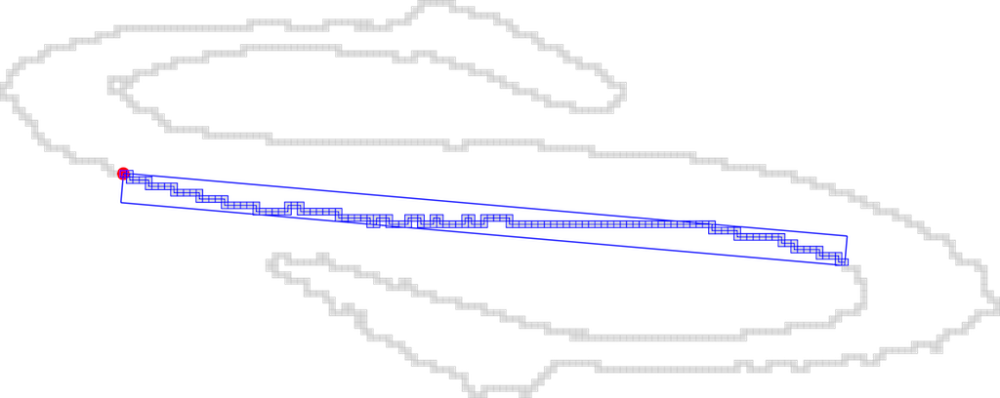

## Tutorial Exercise 4: Computing the Alpha Thick Segments

In this exercise we simply apply the recognition of a maximal Alpha Thick Segment.

  - [ ] **question 1** :  as for previous tutorial, import the contour of the sample file: `contourS.sdp`.
  
  - [ ] **question 2**: create a Board2D and draw a circle at the position of the 30th points:
  
  - [ ] **question 3**: construct an AlphaThickSegmentComputer2D of
        thickness equals to 5 and initialize it in the 30th point and extend it.
        
  - [ ] **question 4**: save the result.
  
  
  
  You should obtain such a visualization:

  

  
  

  

