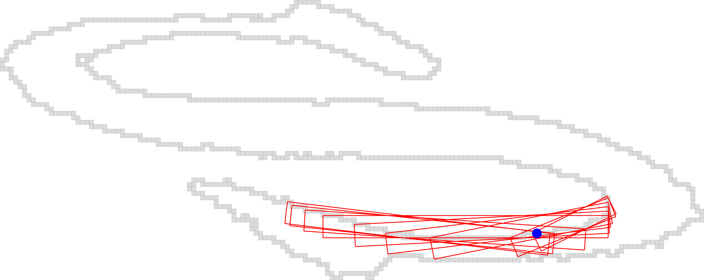

## Tutorial Exercise 5: Computing the Alpha Thick Segments

Here  we explore the helper functions of the ```SegmentComputerUtils``` class ```DGtal/geometry/curves/SegmentComputerUtils.h``` in order to compute all the maximal AlphaThickSegment.


  - [ ] **question 1** : from an alphaThickSegmentComputed3d and by using the static methods firstMaximalSegment(),  lastMaximalSegment() and nextMaximalSegment()  of ```SegmentComputerUtils```, draw all the maximal segments of the curve.
  
  - [ ] **question 2** : as previous exercise, display the results.
  
  
  You should obtain such a visualization:

  <center>
  <a href="results/res.png"></a>
  </center>
  


